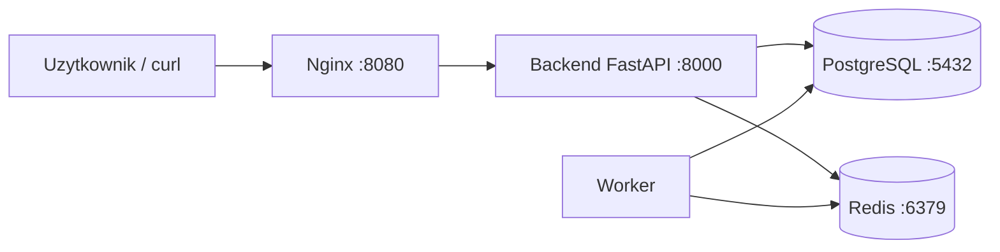

# CHECKLIST

## Architektura



## Uslugi i porty

- `nginx` - reverse proxy, host `http://localhost:8080`
- `backend` - FastAPI, port wewnetrzny `8000`, bez wystawionego portu w trybie podstawowym
- `db` - PostgreSQL, port wewnetrzny `5432`, bez portu na hoście
- `redis` - kolejka/cache, port wewnetrzny `6379`, bez portu na hoście
- `worker` - proces pomocniczy, bez portu

## Start od zera

1. Skopiuj plik `.env.example` do `.env` i ustaw własne wartości, zwłaszcza `POSTGRES_PASSWORD`.
2. Zbuduj i uruchom stos:

```bash
docker compose -f docker-compose.yml up -d --build
```

3. Sprawdz stan usług:

```bash
docker compose ps
```

4. Opcjonalnie sprawdz konfiguracje Compose:

```bash
docker compose config
```

## Testy funkcjonalne

### 1. Healthcheck

```bash
curl http://localhost:8080/health
```

Oczekiwany wynik:

```json
{"status":"ok"}
```

### 2. Dodanie rekordu

```bash
curl -X POST http://localhost:8080/bookmarks \
  -H "Content-Type: application/json" \
  -d "{\"url\":\"https://example.com\"}"
```

Oczekiwany wynik: `201 Created` i JSON z polami `id`, `url`, `status`, `title`, `description`.

### 3. Odczyt listy

```bash
curl http://localhost:8080/bookmarks
```

Oczekiwany wynik: tablica JSON z dodanym rekordem.

### 4. Dowod dzialania workera

Po dodaniu wpisu odczekaj kilka sekund i pobierz liste ponownie. Dla poprawnego URL worker powinien ustawic `status` na `done` i uzupelnic `title`.

## Trwalosc danych

1. Dodaj rekord przez `POST /bookmarks`.
2. Wylacz i uruchom spowrotem stos bez usuwania wolumenow:

```bash
docker compose -f docker-compose.yml down
docker compose -f docker-compose.yml up -d
```

3. Pobierz liste `GET /bookmarks`.

Oczekiwany wynik: rekord nadal jest obecny, bo PostgreSQL korzysta z named volume `postgres_data`.

## Secrets

Plik `docker-compose.secrets.example.yml` pokazuje uruchomienie z Compose secrets. Wymaga utworzenia pliku:

```text
secrets/postgres_password.txt
```

Nastepnie uruchom:

```bash
docker compose -f docker-compose.yml -f docker-compose.secrets.example.yml up -d --build
```

## Wymagania dodatkowe - stan

- Limity CPU/pamieci - zaimplementowane w `docker-compose.yml` dla backendu i workera.
- Rotacja logow - zaimplementowana dla backendu i workera.
- Graceful shutdown - backend i worker obsluguja zamkniecie procesu, a Compose ma `stop_grace_period`.
- Profile srodowisk - zaimplementowany profil `dev` w `docker-compose.override.yml`.
